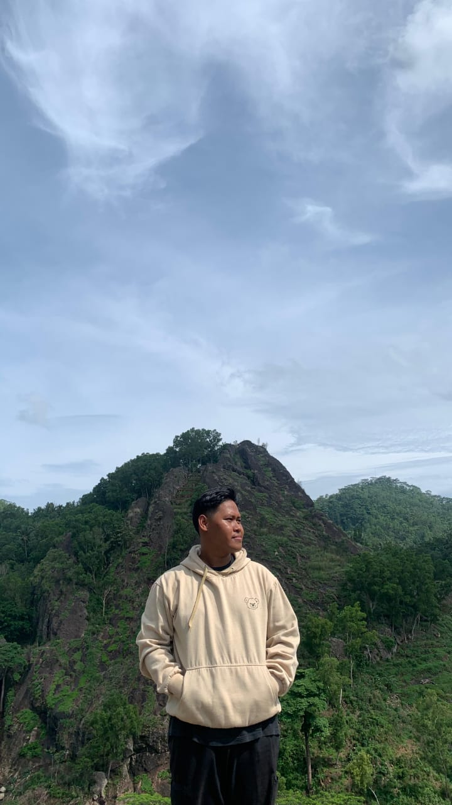

<!DOCTYPE html>
<html lang="en">
<head>
    <meta charset="UTF-8">
    <meta name="viewport" content="width=device-width, initial-scale=1.0">
    <title>Curriculum Vitae - Muhamad Rasyid Raihan</title>
    
</head>
<body>
    

        <h1>Curriculum Vitae</h1>
        
        <!-- Personal Data Section -->
        

            <h2>Personal Data</h2>
            
            <table>
                <tr>
                    <td><strong>Nama Lengkap</strong></td>
                    <td>Muhamad Rasyid Raihan</td>
                </tr>
                <tr>
                    <td><strong>Tempat/Tanggal Lahir</strong></td>
                    <td>Cilegon, 08 July 2003</td>
                </tr>
                <tr>
                    <td><strong>Kebangsaan</strong></td>
                    <td>Indonesia</td>
                </tr>
                <tr>
                    <td><strong>Jenis Kelamin</strong></td>
                    <td>Laki-laki</td>
                </tr>
                <tr>
                    <td><strong>Agama</strong></td>
                    <td>Islam</td>
                </tr>
                <tr>
                    <td><strong>Status Keluarga</strong></td>
                    <td>Belum Menikah</td>
                </tr>
                <tr>
                    <td><strong>Alamat Tinggal</strong></td>
                    <td>Jl. Perjuangan No. 62 Kav. Blok D link. Rokal Barat Cilegon. Rt/Rw : 004/011 Jombang Wetan Kec. Jombang.</td>
                </tr>
                <tr>
                    <td><strong>No Telp</strong></td>
                    <td>081584398240</td>
                </tr>
            </table>
        

        <!-- Education Section -->
        

            <h2>Education</h2>
            <ul>
                <li>MA DAARUL FALAH 2 (2018 – 2021)</li>
                <li>MTS DAARUL FALAH (2015 – 2018)</li>
                <li>SDN BLOK C Cilegon (2009 – 2015)</li>
            </ul>
        

        <!-- Training History Section -->
        

            <h2>Training History</h2>
            <ul>
                <li>Kurir Sicepat (05/05/2021 – 08/11/2021)</li>
                <li>Fried Chicken Geprek Bensu (09/01/2022 – 09/02/2022)</li>
                <li>PT.ADR (12/01/2023 – 12/09/2023)</li>
            </ul>
        

        <!-- Certification Section -->
        

            <h2>Certification</h2>
            <ul>
                <li>Sertifikat Juara Umum Kapuas Open Marching Competition (KOMC)</li>
                <li>Sertifikat Juara Umum Borneo Marching Day</li>
            </ul>
        

    

</body>
</html>
